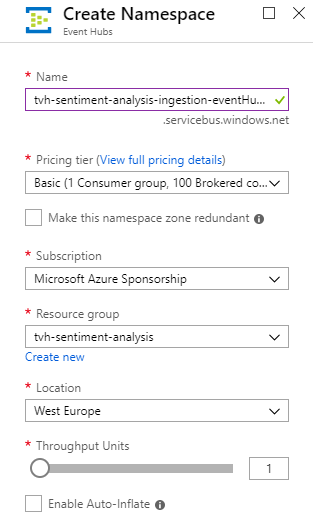
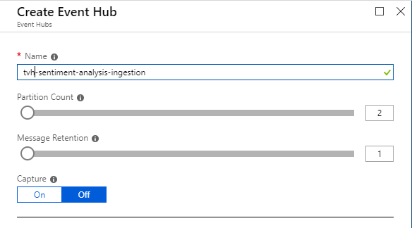
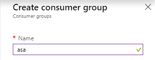
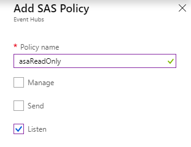
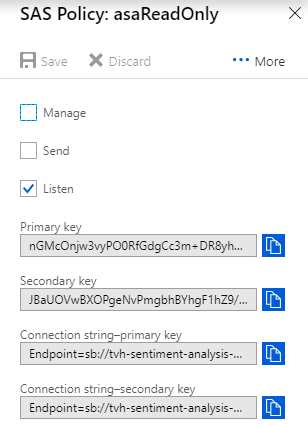
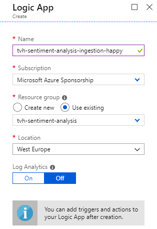
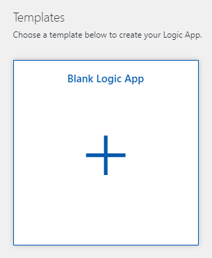
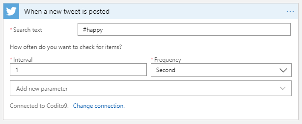
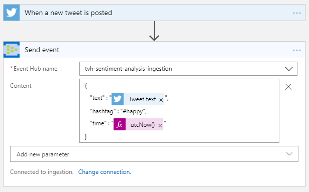
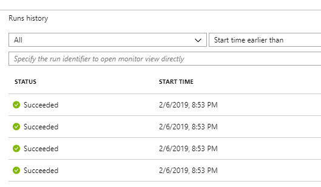

# Sentiment Analysis - Lab Instructions
The purpose of this lab is to show how you can apply in real-time a machine learning model on streaming data.  This use case will apply sentiment analysis on an incoming stream of Twitter tweets.

## Prerequisites
To execute this lab successfully, you need the following:
* An Azure subscription.  You can create a free one over [here](https://azure.microsoft.com/en-us/free/).
* A Power BI pro subscription.  You can create a 60-day trial over [here](https://signup.microsoft.com/signup?sku=a403ebcc-fae0-4ca2-8c8c-7a907fd6c235&email&ru=https%3A%2F%2Fapp.powerbi.com%3Fpbi_source%3Dweb%26redirectedFromSignup%3D1%26noSignUpCheck%3D1).  
Please remark that you have to use an organizational Office365 account.

## Ingest tweets
### Create an Event Hub
First of all, we need a messaging service that can handle huge amounts of streaming data.  Azure Event Hubs is a great service that offers all features to build a realtime data ingestion pipeline.
* Create a new Event Hubs namespace, named _{prefix}-sentiment-analysis-ingestion-eventHubs_
* Provide a unique name, the right subscription, resource group and a location nearby.  Choose _Basic_ as the pricing tier and keep all other settings as default.



* Inside the created Event Hubs namespace, create add a new Event Hub, named _{prefix}-sentiment-analysis-ingestion_.  A partition count of 2 and 1 day of message retention is sufficient.  No need to enable the _capture_ feature.



* Navigate to the previously created Event Hub and add a consumer group with the name _asa_ (referring to Azure Stream Analytics)



* Ensure you are inside the Event Hub tab and click on _Shared access policies_.  Add here a new policy, that gives read access to Azure Stream Analytics.



* Click on the created access policy and copy the connection string with primary key.  You'll need this later in this lab.



### Use Logic Apps to ingest tweets
In order to provide a simplified way to ingest tweets, we will use Azure Logic Apps.
* Create a Logic App, named _{prefix}-sentiment-analysis-ingestion-happy_, choose the same region as previously.



* Open the created Logic App and choose to start from _Blank Logic App_.



* Add the trigger _When a new tweet is posted_ and authenticate with your Twitter account.  Provide _#happy_ as the hashtag to search for and poll every second.



* Below the trigger, click on _New step_ to add an action to send to Event Hubs via the _Send event_ action.  Connect the action to the previously created Event Hub namespace.

* Select the correct Event Hub.  Add the Content parameter and provide the following JSON structure:
```json
{
   "text" : "@{triggerBody()['TweetText']}",
   "hashtag" : "#happy",
   "time" : "@{utcNow()}"
}
```

* This should result in the following Logic App:



* Click _Save_

* Go to the _Overview_ blade and click _Refresh_.  After a while, you should see successful Logic App runs.  All tweets that contain _#happy_ are from now on being ingested into your Event Hub. 



* Repeat the above steps to create another Logic App that ingests tweets that contain _#sad_.

## Create an Azure Machine Learning web service
In this step, we will create an Azure Machine Learning (AML) web service that performs the sentiment analysis.

* Navigate to the Azure AI Gallery to 


