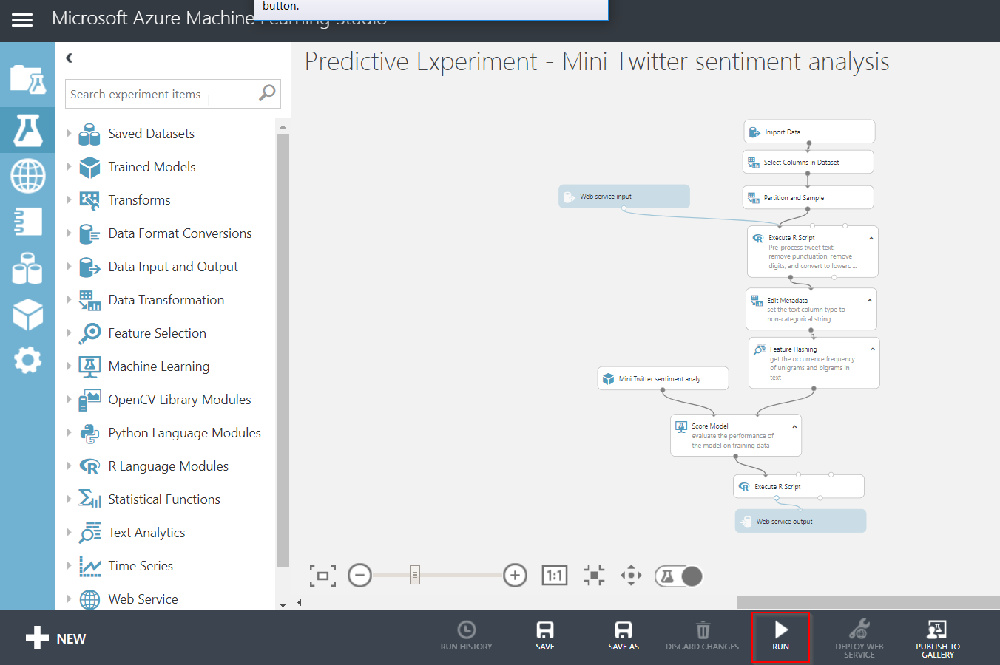

# Sentiment Analysis - Lab Instructions
The purpose of this lab is to show how you can apply in real-time a machine learning model on streaming data.  This use case will apply sentiment analysis on an incoming stream of Twitter tweets.  The lab focusses on giving a sneak preview on what Azure has to offer, it's not optimized for production usage.

## Prerequisites
To execute this lab successfully, you need the following:
* An Azure subscription.  You can create a free one over [here](https://azure.microsoft.com/en-us/free/).
* An Azure Machine Learning Studio workspace.  you can create a free one over [here](https://studio.azureml.net)
* A Power BI pro subscription.  You can create a 60-day trial over [here](https://signup.microsoft.com/signup?sku=a403ebcc-fae0-4ca2-8c8c-7a907fd6c235&email&ru=https%3A%2F%2Fapp.powerbi.com%3Fpbi_source%3Dweb%26redirectedFromSignup%3D1%26noSignUpCheck%3D1).  
Please remark that you have to use an organizational Office365 account.

## Solution design
The high level solution design of this lab looks like this.


* Two Logic Apps are capturing tweets that contain _#happy_ or _#sad_
* These tweets are ingested into Event Hubs
* Azure Stream Analytics performs the sentiment analysis against an Azure Mache Learning web service
* Azure Stream Analytics also calculates the average value over a specific time window
* The results are outputted to Power BI, where they can be easily visualized

## Ingest tweets
### Create an Event Hub
First of all, we need a messaging service that can handle huge amounts of streaming data.  Azure Event Hubs is a great service that offers all features to build a realtime data ingestion pipeline.
* Create a new Event Hubs namespace, named _{prefix}-sentiment-analysis-ingestion-eventHubs_
* Provide a unique name, the right subscription, resource group and a location nearby.  Choose _Basic_ as the pricing tier and keep all other settings as default.


* Inside the created Event Hubs namespace, create add a new Event Hub, named _{prefix}-sentiment-analysis-ingestion_.  A partition count of 2 and 1 day of message retention is sufficient.  No need to enable the _capture_ feature.


### Create a consumer group with an access policy
Each client that reads from the Event Hub needs to be assigned to a particular consumer group.  It's a good practise to give each consumer group a separate access policy, so you can revoke each one of them separately.

* Navigate to the previously created Event Hub and add a consumer group with the name _asa_ (referring to Azure Stream Analytics)


* Ensure you are inside the Event Hub tab and click on _Shared access policies_.  Add here a new policy, that gives read access to Azure Stream Analytics.


* Click on the created access policy and copy the connection string with primary key.  You'll need this later in this lab.


### Create a Logic App
In order to provide a simplified way to ingest tweets, we will use Azure Logic Apps.
* Create a Logic App, named _{prefix}-sentiment-analysis-ingestion-happy_, choose the same region as previously.


* Open the created Logic App and choose to start from _Blank Logic App_.


### Add a trigger that receives specific tweets
This Logic App must fire each time a tweet contains a certain key word.

* Add the trigger _When a new tweet is posted_ and authenticate with your Twitter account.  Provide _#happy_ as the hashtag to search for and poll every second.


### Send the tweets to Event Hubs
This Logic App has to send the captured tweets to Event Hubs.

* Below the trigger, click on _New step_ to add an action to send to Event Hubs via the _Send event_ action.  Connect the action to the previously created Event Hub namespace.

* Select the correct Event Hub.  Add the Content parameter and provide the following JSON structure:
```json
{
   "text" : "@{triggerBody()['TweetText']}",
   "hashtag" : "#happy",
   "time" : "@{utcNow()}"
}
```

* This should result in the following Logic App:


* Click _Save_

* Go to the _Overview_ blade and click _Refresh_.  After a while, you should see successful Logic App runs.  All tweets that contain _#happy_ are from now on being ingested into your Event Hub. 


> Repeat the above steps to create another Logic App that ingests tweets that contain _#sad_.

## Create a web service that performs sentiment analysis
In this step, we will create an Azure Machine Learning (AML) web service that performs the sentiment analysis.

* Navigate to the Azure AI Gallery [experiment for sentiment analysis](https://gallery.azure.ai/Experiment/Predictive-Mini-Twitter-sentiment-analysis-Experiment-1). 

* Click on _Open in studio_.


* Select and/or create a AML Studio workspace.  Click OK if you get a warning about upgrading the experiment to a later version.


* Run the experiment, via the command at the bottom of the page, in order to train the model.  This can take several minutes.



* Next, you can click _Deploy web service_.  After a while, you get redirected to the overview page of the created web service.  Copy already the _API key_, as you will need this later in the lab.


* Via the _Test_ button, you can easily provide a value to be analyzed:


* At the bottom of the page, the result appears.


* Click now on the _REQUEST/RESPONSE_ link, to go to the _API Help Page_, where you need to copy the web service URL for later usage.


## Process tweets in realtime

### Create an Azure Stream Analytics Job
We need an Azure Stream Analytics Job to process the incoming stream of tweets in realtime.

* Create a Stream Analytics Job, named _{prefix}-sentiment-analysis-asa_.  Give the appropriate resource group and identical location as the previously created services.  Keep _Cloud_ as the hosting environment and set the _Streaming units_ to 1.  The latter will save you some costs.


### Configure the Event Hubs Input

Let's now create a new _Input_, which should refer to the Event Hub that we created.  
* Go to the _Inputs_ blade and click _Add stream input_.  Choose _Event Hub_.

* In case you created the Event Hub yourself, you can use the _Select Event Hub from your subscription_ option.  If not, provide the settings manually.  You can retrieve all these settings from the Event Hubs connection string.


* The best way to verify if the input is configured correctly, is by click on _Sample data_ and specify a timespan of about 20 seconds.  This functionality will connect already to the Event Hub itself, so in case of issues, you'll get an exception.

### Create AML Web Service function

To be able to connect to the AML web service, we have to create a new _Function_.  

* Go to the _Funtions_ blade and click _Add_.  Choose _Azure ML_.  

* Provide the function alias _getSentiment_.  Provide the settings manually by specifying the _Url_ and _API Key_ that you copied previously.


### Configure the Power BI output

We need to to send the result to Power BI, which means creating an _Output_.  

* Go to the _Outputs_ blade and click _Add_.  Choose Power BI.

* Provide the output alias _powerbi_.  Specify a meaningful _Dataset name_ and _Table name_.  These names will be used to create automatically a data set in Power BI.


* Click on _Authorize_ and login with your Power BI account and click _Save_.

* You can test the output via the _"..."_ button.

### Configure the query
Now, we have to write a query that calls the AML function to get the sentiment score for each tweet and aggregates the results per 10 seconds.

* Go to the _Query_ blade and paste the following SQL statement in the query window.

```sql
--Create a temp table that contains the sentiment score (via the getSentiment function)
WITH 
scoredData AS (  
    SELECT time, hashtag, getSentiment(text) as result 
    FROM twitterfeed 
)

--Select average score over a window of 10 seconds and send it to Power BI
SELECT 
    System.TimeStamp as time, 
    hashtag, 
    AVG(result.[Score]) as score 
INTO
    powerbi
FROM 
    scoredData 
GROUP BY 
    hashtag, TumblingWindow(second,10) 
```

* Click _Save_.

### Start and monitor the job

> In the portal, there are no real good testing capabilities.  When using Visual Studio, you can debug your query, while it is connected to real data inputs.

* Go to the _Overview_ blade and start the job from now.

* It takes a while before the job is completed up and running, but after a minute of 5, you should see that the first events are getting processed.


## Visualize results in Power BI

In your Power BI namespace, you should see under the _Datasets_ tab, that a data set has been automatically created by Azure Stream Analytics.


* In the _Actions_ of your data set, choose _Create report_.

* Select the _Line chart_ as the chart type.  Take _time_ as the _Axis_, _hashtag_ as the _Legend_ and _score_ as the _Values_.


* Make the chart itself bigger, so it nicely fits your screen.  You should see the results by now.  Normally, _#happy_ should have a significantly better sentiment score, compared to _#sad_.


* Save the report and give it a meaningful name.

> Optionally, you can try to create a dashboard that gets updated in realtime.  More info about this can be found [here](https://docs.microsoft.com/en-us/power-bi/service-real-time-streaming#set-up-your-real-time-streaming-dataset-in-power-bi).


#### Congratulations, you've finished this lab!


